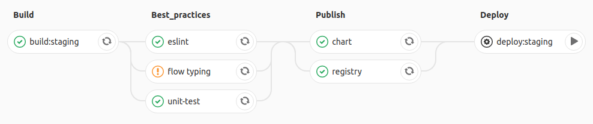

## Front-End

[](https://github.com/micro-company/react-app/blob/master/LICENSE)

An example of demonstration work with a microservice architecture


### Getting start

1. Create `.env` file with ENV variables
2. Install depdednecies `npm i`
3. Run application `npm start`

#### Kubernetes

```
# Add repo to Helm
helm repo add micro-company https://micro-company.github.io/charts/

# Update repo charts
helm repo update

# Install project
helm install micro-company/react-app
```

#### Enviroment variables

| **NAME**                           | **VALUE**             |
| ---------------------------------- | --------------------- |
| REACT_APP_API_URL                  | http://localhost:4070 |
| REACT_APP_GOOGLE_RECAPTCHA_SITEKEY | secretKey             |
| **For CI**                         | -                     |
| GITHUB_USER                        | -                     |
| GITHUB_PASSWORD                    | -                     |

#### CI FLOW


